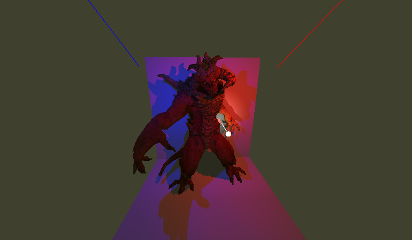

# BigyRenderer

Source code of a school project.
The goal is to create a 3D rendering engine step by step, from scratch.



## Installation

You can try this code by simply:

- Cloning this repo : `git clone https://github.com/FurWaz/BigyRenderer`
- Setting up CMake in a build folder: `mkdir build; cmake ..`
- Compiling the source code: `cmake --build .`

It should create an executable file in `/build/Debug` or `/build/Release` depending of your cmake configuration.

## Running

You can run the executable file with the following command:

```bash
./BigyRenderer <path_to_scene.txt>
```
This will continuously render the scene described in the scene file until you close the window.
Each frame, the camera will rotate around the scene to show a new view angle.

If you don't want the camera to rotate, you can set `bool loop = false;` at the beginning of the `main.cpp` file (line `12`).

As you can see, you need to provide a scene file to render.
You can find some examples in the `resources` folder.

## Notes
Compile and run the executable in `Release` mode for better performance.
This can double the frame rate.

## Features
This renderer currently supports:
- Diffuse, specular, and normal mapping
- Point, directional, and spot lights
- Shadow mapping
- Custom scene files
- Custom model files
- Custom rendering resolutions (including non-square resolutions)

## Scenes

The scenes files are used to describe the scene to render.
They can contain the following elements:
- Models to render (see the [Models](#models) section for more details)
- Lights (see the [Lights](#lights) section for more details)

The scene files syntax is pretty simple. You first describe the type of element you want to add, then you provide the parameters of this element.
Here is an example of a scene file:

```
# M = model : path / position / rotation / scale
M ../../resources/diablo 0,0,0 0,0,0 1,1,1

# L = light : type / color / intensity / range / cone_angle (spot only) / position / rotation
# light types : [p]oint / [d]irectional / [s]pot
L s 0,0,255 2.0 4.0 1.3 -0.5,1,1 -0.5,0,0
L a 64,0,0 0.5 0.0 0.0 0,0,0 0,0,0
```

This file for examples will create a scene with a model of Diablo and one spot light poiting towards it, and a slight red ambient light.

## Models
You can easily add models to a scene by providing the path to the model folder.

This folder should contain the following files:
- `msh.obj` : the mesh file, containing the vertices, normals, and faces of the model
- `diffuse.png` : the diffuse texture file, containing the model's color
- `specular.png` : the specular texture file, containing the model's shininess
- `normal.png` : the normal texture file, containing the model's normals

The file examples above are using the .png format, but you can use any format supported by the stb_image library (such as .jpg, .bmp, .tga, ...).

## Lights
You can add lights to a scene by providing the type of light you want to add.

The light types are:
- `p` : point light
- `d` : directional light
- `s` : spot light

Please note that, for now, only the spot light type is implemented "correctly".

The directional light as a fixed shadowmap scale, this means that objects far away from the light's direction will not cast shadows, because they will be "out of the shadowmap".

The point light's shadowmap implementation has some big improvements to be made. The current 360° field of view is currently compressed into a single squared shadowmap, which makes weird artifacts where the shadowmap's deformation is too high (at sphere's poles, and -180° to 180° angles).

## Author

[FurWaz](https://github.com/FurWaz)
